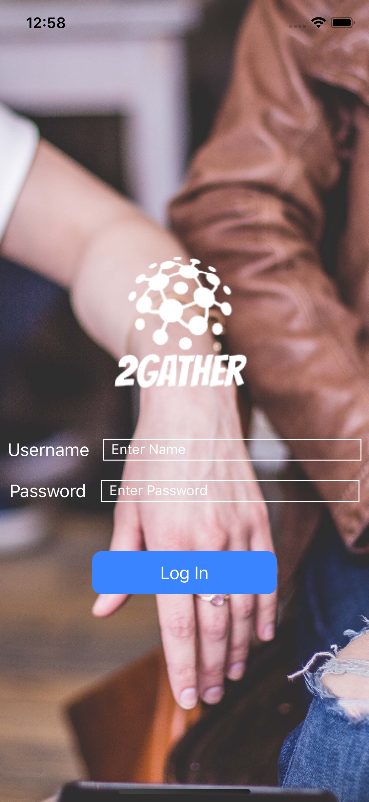
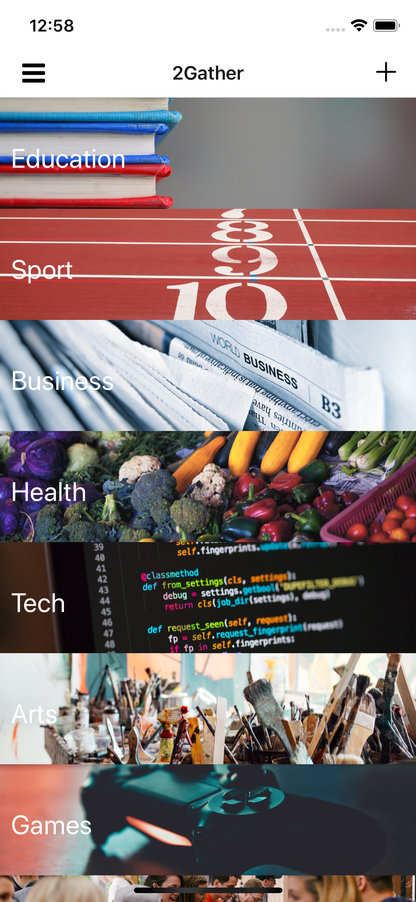
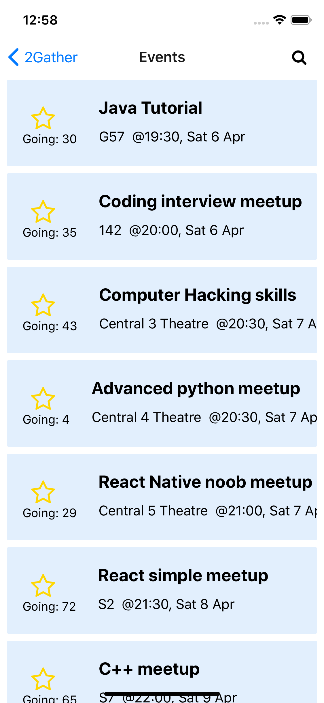
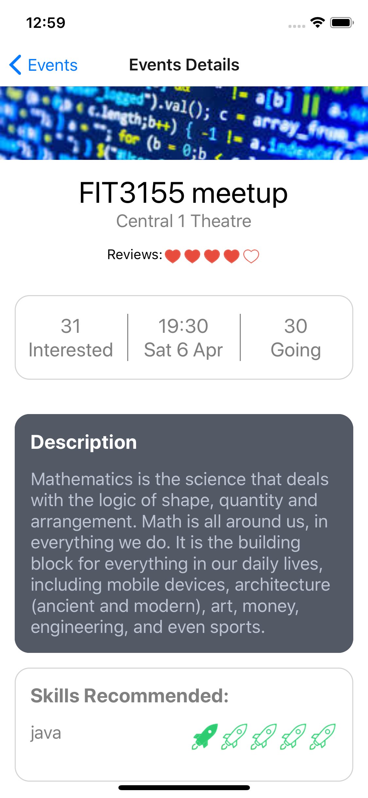
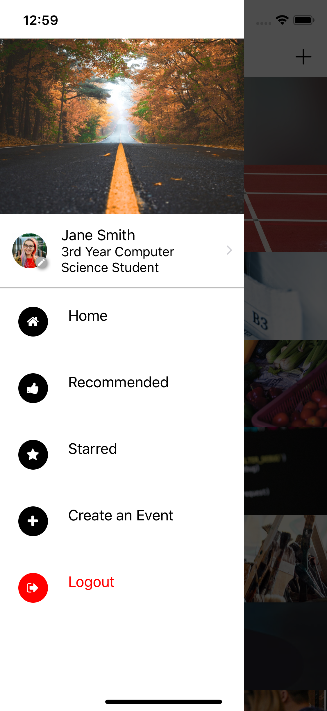
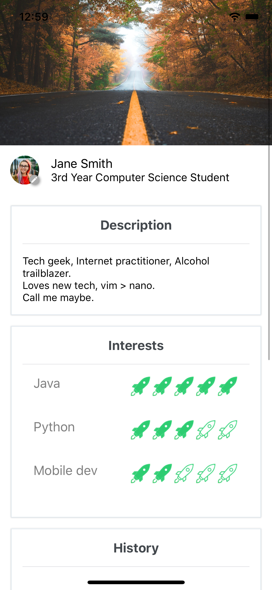

# 2gather
🤗👦👦🏽👧🏻👪

2gather - a solution to meetups for students.

As a student, most of the meetups from other companies (for example Meetup) does not best suit for students. They are designed for professionals at that particular area to connect with others. However, student might not have the qualification to join such events. Facebook groups are not the finest solution as it is not an organized and formal way of addressing this issue.

Hence we have build this mobile application which allows student to login, organize and join meetups based on their preferred interest and the meetup's recommended skills.

Another Feature of this application is if student log in with their student account, we will grab what units that student is going to do in that particular meetup and suggest a series of meetups to help build up to a more complex skill for them to fit in their university courses.

We made this project in 24 hours in Hackamon 2019.

Project made in React Native and Firebase.

## How does it work

Below are some screenshots of how the program looks.

 

## Development Team
- [Jonathan Yeung (Team Lead)](https://github.com/YeungJonathan)
- [Marcus Ooi](https://github.com/MarcusKJOoi)
- [Zain Shroff](https://github.com/zain610)
- [Tricia Wajaya](https://github.com/TriciaWijaya)
- [Leon Wang](https://github.com/LeonLiAng929)

## Trying it out
Requirement:
- Node
- Expo

Steps:
1. Clone and Download the project files.
2. npm i
3. expo start
